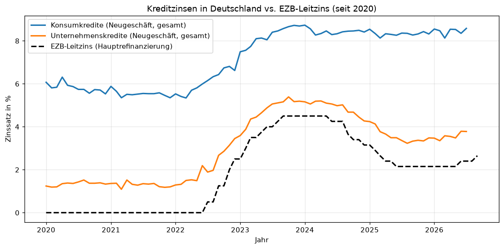
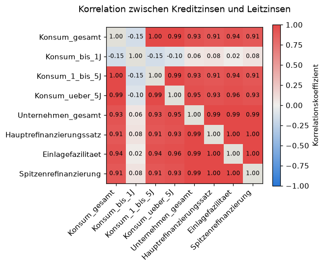
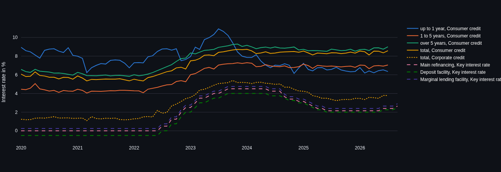
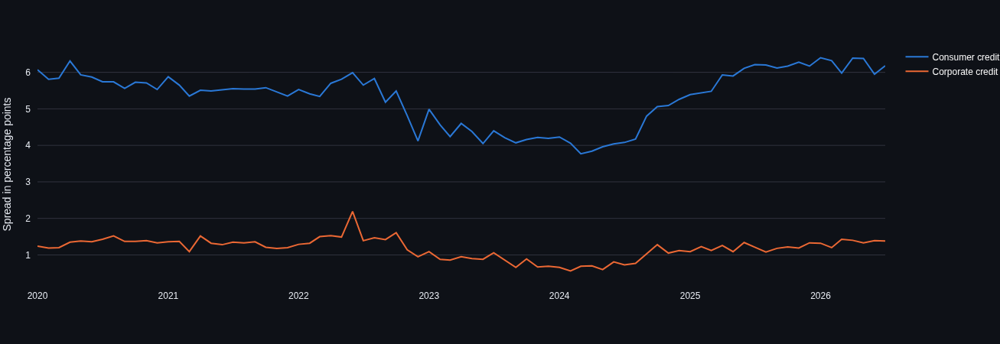

# Lending Rates in Germany vs. ECB Key Interest Rate

**Languages:** [Deutsch](README.md) · English

Analysis of interest rates on consumer and corporate loans (new business) in Germany compared with the ECB key interest rates, period January 2020 to September 2026 (loan rates up to July 2026). Data basis: official Bundesbank time series, retrieved automatically via the SDMX REST API.

**Live demo:** [https://german-credit-rates-vs-ecb-rate-ywntxevqbxdtuaskipepzy.streamlit.app](https://german-credit-rates-vs-ecb-rate-ywntxevqbxdtuaskipepzy.streamlit.app/?lang=en) (opens in English; language switch in the sidebar)

**Note:** This project was developed with the support of AI (Claude) — for code structure, debugging and documentation. I do not see myself as a professional software developer. My focus is data analysis.

---

## Screenshots

### Notebook: Interest rate development over time


---

### Notebook: Correlation with the key interest rate


---

### Dashboard: Interest rate development over time


---

### Dashboard: Interest rate spread


---

## Data source

[Bundesbank SDMX Web Service](https://api.statistiken.bundesbank.de) — public, no registration required.

| Time series | Dataflow | Series key |
|---|---|---|
| Consumer credit, total | BBIM1 | M.DE.B.A2B.A.C.A.2250.EUR.N |
| Consumer credit, up to 1 year | BBIM1 | M.DE.B.A2B.F.R.A.2250.EUR.N |
| Consumer credit, 1–5 years | BBIM1 | M.DE.B.A2B.I.R.A.2250.EUR.N |
| Consumer credit, over 5 years | BBIM1 | M.DE.B.A2B.J.R.A.2250.EUR.N |
| Corporate credit, total | BBIM1 | M.DE.B.A2A.A.R.A.2240.EUR.N |
| Main refinancing rate | BBIN1 | M.D0.ECB.ECBMIN.EUR.ME |
| Deposit facility rate | BBIN1 | M.D0.ECB.ECBFAC.EUR.ME |
| Marginal lending facility rate | BBIN1 | M.D0.ECB.ECBREF.EUR.ME |

The five loan rate series refer to new business (not existing loans). All series are monthly values.

---

## Architecture

```
Bundesbank SDMX API
        │
        ▼
Jupyter Notebook  (retrieval, cleaning, EDA)
        │
        ▼
Star schema export (3 CSVs, keys instead of a wide table)
        │
        ▼
Streamlit dashboard (dashboard.py)
```

## Repo structure

```
├── bundesbank_kreditzinsen_analysis.ipynb   # data retrieval + EDA, exports the 3 star schema CSVs
├── dashboard.py                             # Streamlit dashboard
├── requirements.txt                         # dependencies of the dashboard
├── dim_zeit.csv                             # dimension: time
├── dim_zinsart.csv                          # dimension: interest rate type
├── fact_zinssaetze.csv                      # fact table
├── kreditzinsen_leitzins_seit_2020.csv      # wide table with the same values (is neither produced by
│                                            #   the current notebook nor used by the dashboard)
├── images/                                  # screenshots for the README
├── README.md                                # German version
└── README.en.md                             # English version (this file)
```

---

## Data model (star schema)

Instead of a wide table: one fact table + two dimension tables, linked via the key columns `Zeit_ID` and `Zinsart_ID`. The notebook labels the schema "Star-Schema für Power BI" (star schema for Power BI); a Power BI report is not part of this repo.

- **Dim_Zeit** (81 rows): one row per month (01/2020–09/2026), key `Zeit_ID` (format `YYYYMM`), further columns: `Datum`, `Jahr`, `Quartal`, `Monat`, `Jahr_Monat`
- **Dim_Zinsart** (8 rows): one row per interest rate series, key `Zinsart_ID`, further columns: `Zinsart_Code`, `Kategorie` (Konsumkredit / Unternehmenskredit / Leitzins, i.e. consumer credit / corporate credit / key interest rate), `Laufzeit`
- **Fact_Zinssaetze** (638 rows): one row per (month, interest rate type) with `Zinssatz` — only values that actually exist. Of the 648 possible combinations (81 × 8), 10 are missing: the five loan rate series for 08/2026 and 09/2026.

CSV format: separator `;`, decimal comma, UTF-8 with BOM.

---

## Setup

```bash
# Dependencies
pip install pandas numpy matplotlib requests jupyter streamlit plotly

# Run the notebook (fetches data live from the Bundesbank, exports the 3 CSVs)
jupyter lab bundesbank_kreditzinsen_analysis.ipynb

# Start the dashboard (run in the repo folder, where the 3 CSVs are read)
streamlit run dashboard.py
```

---

## Financial report: key results

All figures below are calculated from the CSV files in the repo (Bundesbank data). The loan rate series run to 07/2026, the key interest rate series to 09/2026. A new notebook run fetches the then-current data and may differ.

### Key interest rate cycle since 2020 (main refinancing rate)

- **01/2020–06/2022**: constant at 0.00% (the deposit facility rate was at −0.50% during this period)
- **07/2022**: first increase (+0.50 pp)
- **09/2023–05/2024**: peak at 4.50%
- **06/2024–06/2025**: eight cuts, from 4.50% to 2.15%
- **06/2025–05/2026**: constant at 2.15%
- **06/2026–09/2026**: rise to 2.40% (06/2026) and 2.65% (09/2026)
- In total 20 changes between consecutive monthly values (12 increases, 8 cuts); 18 distinct rate levels since 2020

### Relationship between loan rate and key interest rate (correlation, Pearson r)

Basis: the 79 months 01/2020–07/2026 in which all series have values.

| Series | r (vs. main refinancing rate) |
|---|---|
| Corporate credit, total | **0.993** |
| Consumer credit, over 5 years | 0.932 |
| Consumer credit, 1–5 years | 0.911 |
| Consumer credit, total | 0.906 |
| Consumer credit, up to 1 year | **0.077** |

- Corporate credit: r = 0.993. The slope of the regression line is 0.87 — on average, a one percentage point higher key interest rate goes along with a 0.87 percentage points higher corporate loan rate.
- Consumer credit, total: r = 0.906, slope 0.69.
- Consumer credit, 1–5 years and over 5 years: r = 0.911 and 0.932, respectively.
- Consumer credit, up to 1 year: r = 0.077, i.e. practically no linear relationship with the key interest rate. This finding is striking but is only reported here, not explained causally (the available data are not sufficient for that).

### Interest rate spread (loan rate minus main refinancing rate, same month)

| | 01/2020 | 07/2026 | Minimum | Maximum |
|---|---|---|---|---|
| Consumer credit, total | 6.07 pp | 6.18 pp | 3.77 pp (03/2024) | 6.40 pp (01/2026) |
| Corporate credit, total | 1.24 pp | 1.38 pp | 0.56 pp (02/2024) | 2.19 pp (06/2022) |

- In 07/2026 the spread is 0.11 pp higher for consumer loans and 0.14 pp higher for corporate loans than in 01/2020. In between it fluctuates considerably; it was narrowest in February 2024 (corporate loans) and March 2024 (consumer loans), respectively.
- The consumer loan spread was larger than the corporate loan spread in all 79 months, with a median of 4.61 times as large (minimum 2.74 times in 06/2022, maximum 7.25 times in 02/2024).

### Current values

| Interest rate type | Value | As of |
|---|---|---|
| Main refinancing rate | 2.65% | 09/2026 |
| Deposit facility rate | 2.50% | 09/2026 |
| Marginal lending facility rate | 2.90% | 09/2026 |
| Consumer credit, total | 8.58% | 07/2026 |
| Corporate credit, total | 3.78% | 07/2026 |

### Limitations

- Correlation does not prove causation — the analysis is descriptive, not an econometric model
- The loan rate series contain no values for 08/2026 and 09/2026 (not available at retrieval); the key interest rate series run to 09/2026
- For corporate loans only the total series is used (no breakdown by maturity); for consumer loans there are three additional series by rate fixation
- The series "Consumer credit, total" has the letter `C` at one position in the series key, while the other four loan series have `R` there. According to the ECB code list for MFI interest rate statistics, `C` stands for the annual percentage rate of charge including costs (APRC) and `R` for the annualised agreed rate or narrowly defined effective rate (AAR/NDER). The total series therefore possibly does not measure exactly the same rate concept as the series by rate fixation; comparisons between the two should be read with caution.
- New business — no statement about existing loans or individual loan terms

---

## Tech stack

Python · pandas · NumPy · Matplotlib · requests · Jupyter · Streamlit · Plotly

## Author

Amir — [GitHub](https://github.com/Amirhouschang)
