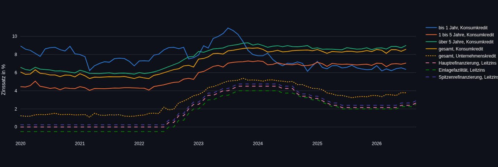
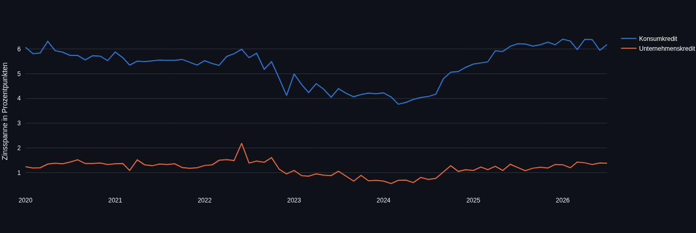

# Kreditzinsen in Deutschland vs. EZB-Leitzins

Analyse der Effektivzinssätze für Konsumenten- und Unternehmenskredite (Neugeschäft) in Deutschland im Vergleich zu den EZB-Leitzinsen, seit Januar 2020. Datenbasis: offizielle Bundesbank-Zeitreihen, automatisiert über die SDMX-REST-API abgerufen.

**Live-Demo:** _[Link folgt nach Deployment auf Streamlit Community Cloud]_

**Hinweis:** Dieses Projekt wurde mit Unterstützung von KI (Claude) entwickelt — bei Code-Struktur, Debugging und Dokumentation. Ich verstehe die Logik, kann sie erklären und weiterentwickeln, sehe mich aber nicht als professionellen Software-Entwickler. Mein Fokus liegt auf Datenanalyse.

---

## Screenshots

| Notebook: Zinsentwicklung über Zeit | Notebook: Korrelation mit dem Leitzins |
|---|---|
|  |  |

| Dashboard: Zinsentwicklung über Zeit | Dashboard: Zinsspanne |
|---|---|
|  |  |

---

## Datenquelle

[Bundesbank SDMX Web Service](https://api.statistiken.bundesbank.de) — öffentlich, keine Anmeldung nötig.

| Zeitreihe | Dataflow | Series Key |
|---|---|---|
| Konsumkredit, gesamt | BBIM1 | M.DE.B.A2B.A.C.A.2250.EUR.N |
| Konsumkredit, bis 1 Jahr | BBIM1 | M.DE.B.A2B.F.R.A.2250.EUR.N |
| Konsumkredit, 1–5 Jahre | BBIM1 | M.DE.B.A2B.I.R.A.2250.EUR.N |
| Konsumkredit, über 5 Jahre | BBIM1 | M.DE.B.A2B.J.R.A.2250.EUR.N |
| Unternehmenskredit, gesamt | BBIM1 | M.DE.B.A2A.A.R.A.2240.EUR.N |
| Hauptrefinanzierungssatz | BBIN1 | M.D0.ECB.ECBMIN.EUR.ME |
| Einlagefazilität | BBIN1 | M.D0.ECB.ECBFAC.EUR.ME |
| Spitzenrefinanzierung | BBIN1 | M.D0.ECB.ECBREF.EUR.ME |

Alle Werte sind Effektivzinssätze im Neugeschäft (keine Bestandszinsen).

---

## Architektur

```
Bundesbank SDMX-API
        │
        ▼
Jupyter Notebook  (Abruf, Bereinigung, EDA)
        │
        ▼
Star-Schema-Export (3 CSVs, Keys statt breiter Tabelle)
        │
        ├──▶ Streamlit-Dashboard (dashboard.py)
        └──▶ Power BI (optional, gleiche CSVs)
```

## Repo-Struktur

```
├── bundesbank_kreditzinsen_analysis.ipynb   # Datenabruf + EDA
├── dashboard.py                             # Streamlit-Dashboard
├── dim_zeit.csv                             # Dimension: Zeit
├── dim_zinsart.csv                          # Dimension: Zinsart
├── fact_zinssaetze.csv                      # Faktentabelle
├── images/                                  # Screenshots für README
└── README.md
```

---

## Datenmodell (Star-Schema)

Statt einer breiten Tabelle: eine Fact-Tabelle + zwei Dimensionstabellen, verbunden über Surrogate Keys. Kein Power-Query-Nachbearbeiten nötig — CSVs importieren, Beziehungen über die Keys herstellen.

- **Dim_Zeit** (81 Zeilen): eine Zeile pro Monat, Key `Zeit_ID` (Format `JJJJMM`)
- **Dim_Zinsart** (8 Zeilen): eine Zeile pro Zinsreihe, mit `Kategorie` (Konsumkredit / Unternehmenskredit / Leitzins) und `Laufzeit`
- **Fact_Zinssaetze** (638 Zeilen): eine Zeile pro (Monat, Zinsart), nur tatsächlich vorhandene Werte — keine künstlichen Leerzeilen für noch nicht veröffentlichte Monate

---

## Setup

```bash
# Abhängigkeiten
pip install pandas numpy matplotlib requests jupyter streamlit plotly

# Notebook ausführen (ruft Daten live von der Bundesbank ab, exportiert die 3 CSVs)
jupyter lab bundesbank_kreditzinsen_analysis.ipynb

# Dashboard starten (braucht die 3 CSVs im selben Ordner)
streamlit run dashboard.py
```

---

## Finanzbericht: Kernergebnisse

Alle Zahlen unten sind direkt aus den Bundesbank-Daten berechnet (Stand der Kreditzins-Zeitreihen: Juli 2026, Leitzins-Zeitreihen: September 2026 — die Bundesbank veröffentlicht Kreditzinsen mit ca. 2 Monaten Verzug).

### Leitzinszyklus seit 2020

- **01/2020–06/2022**: Hauptrefinanzierungssatz konstant bei 0,00 % (Nullzinsphase)
- **07/2022**: erste Erhöhung (+0,50 pp) — Beginn der Zinswende
- **09/2023**: Höchststand bei 4,50 %
- **06/2024–06/2025**: Zinssenkungszyklus, 4,50 % → 2,15 %
- **06/2025–05/2026**: Plateau bei 2,15 %
- **seit 06/2026**: erneuter leichter Anstieg, aktuell (09/2026) 2,65 %
- Insgesamt 20 Monate mit Leitzinsänderungen, 18 unterschiedliche Zinsniveaus seit 2020

### Zusammenhang Kreditzins ↔ Leitzins (Korrelation, Pearson r)

| Reihe | r (vs. Hauptrefinanzierungssatz) |
|---|---|
| Unternehmenskredit, gesamt | **0,993** |
| Konsumkredit, über 5 Jahre | 0,932 |
| Konsumkredit, 1–5 Jahre | 0,911 |
| Konsumkredit, gesamt | 0,906 |
| Konsumkredit, bis 1 Jahr | **0,077** |

Unternehmenskredite folgen dem Leitzins nahezu 1:1. Konsumkredite mit längerer Zinsbindung folgen ihm ebenfalls stark, aber mit spürbar geringerer Kopplung. Konsumkredite mit Zinsbindung bis 1 Jahr sind mit dem Leitzins praktisch unkorreliert — dieser Befund ist auffällig, wird hier aber nur berichtet, nicht kausal erklärt (dafür reichen die vorliegenden Daten nicht aus).

### Zinsspanne (Kreditzins minus Leitzins)

| | 01/2020 | 07/2026 | Minimum | Maximum |
|---|---|---|---|---|
| Konsumkredit, gesamt | 6,07 pp | 6,18 pp | 3,77 pp (03/2024) | 6,40 pp (01/2026) |
| Unternehmenskredit, gesamt | 1,24 pp | 1,38 pp | 0,56 pp (02/2024) | 2,19 pp (06/2022) |

Die Marge bei Konsumkrediten liegt durchgehend beim 4- bis 5-Fachen der Marge bei Unternehmenskrediten. Beide Margen sind 07/2026 in etwa auf dem Niveau von 01/2020 — dazwischen aber mit deutlichen Schwankungen, am engsten jeweils Anfang/Mitte 2024.

### Aktuelle Werte

| Zinsart | Wert | Stand |
|---|---|---|
| Hauptrefinanzierungssatz | 2,65 % | 09/2026 |
| Einlagefazilität | 2,50 % | 09/2026 |
| Spitzenrefinanzierung | 2,90 % | 09/2026 |
| Konsumkredit, gesamt | 8,58 % | 07/2026 |
| Unternehmenskredit, gesamt | 3,78 % | 07/2026 |

### Einschränkungen

- Korrelation belegt keine Kausalität — die Analyse ist deskriptiv, kein ökonometrisches Modell
- Kreditzins-Zeitreihen für 08/2026 und 09/2026 lagen zum Zeitpunkt des Abrufs noch nicht vor (Bundesbank-Veröffentlichungsverzug)
- Unternehmenskredite liegen nur als Gesamtwert vor, keine Aufteilung nach Laufzeit (im Gegensatz zu Konsumkrediten)
- Effektivzinssätze im Neugeschäft — keine Aussage über Bestandskredite oder individuelle Kreditkonditionen

---

## Tech Stack

Python · pandas · NumPy · Matplotlib · Jupyter · Streamlit · Plotly

## Autor

Amir — [GitHub](https://github.com/Amirhouschang)
